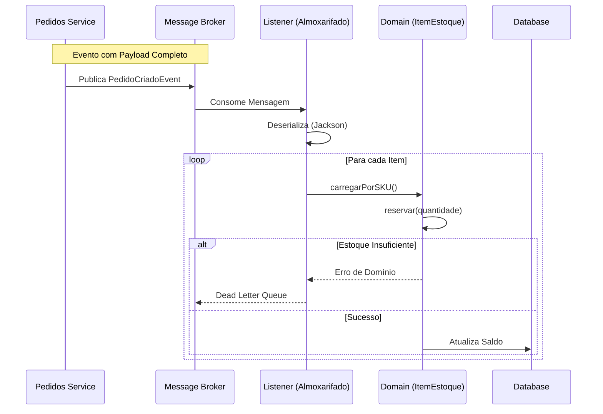

# 📦 Pet Friends - Inventory Service (Almoxarifado)


> **Microsserviço de Gestão de Estoque e Separação**
>
> Responsável pelo controle de inventário, reserva de SKUs e processamento de ordens de separação via eventos.

---

## 📖 Visão Geral

O **Almoxarifado Service** opera de forma reativa dentro do ecossistema Pet Friends. Ele não recebe chamadas síncronas de escrita para baixar estoque; em vez disso, ele reage a eventos de `PedidoCriado` para realizar a reserva e separação de produtos, garantindo desacoplamento do checkout.

### Fluxo de Integração (Event-Driven)



---

## 🏗️ Arquitetura de Domínio

O projeto segue princípios de DDD (Domain-Driven Design) para garantir a integridade do inventário.

* **Agregado Raiz**: `ItemEstoque`
* **Value Objects**: `SKU` (Identidade e validação de formato)
* **Comunicação**: Assíncrona via `Spring Events` (simulando RabbitMQ/Kafka).

**Estrutura de Pacotes**

```plaintext
br.com.petfriends.almoxarifado
├── application      # Casos de uso e Listeners
├── domain           # Regras de negócio (Puras e isoladas)
│   └── stock        # Agregado de Estoque
└── infra            # Configurações e Adaptadores
    ├── config       # Configuração Jackson/Messaging
    └── events       # DTOs de integração (Contratos)
```

---

## 🚀 Como Executar

**Pré-requisitos**

* JDK 21
* Maven 3.8+

**Rodando a Aplicação**

```bash
mvn spring-boot:run
```

**Testando a Ingestão de Eventos**

Como o serviço é passivo (Escuta eventos), verifique os logs para confirmar o processamento:

```plaintext
INFO ... PedidoEventListener : Novo evento recebido do Pedidos: PedidoID 12345
INFO ... PedidoEventListener : Separando SKU: PET-999 - Qtd: 2
```

**Pet Friends Engineering Team** © 2025
